<div align="center">
  <h1>🎉 Event Management App</h1>
  <p>A comprehensive Flutter-based event management solution with Firebase backend integration</p>
  
  
  
  
  
  
</div>

---

## 🚀 Overview

A full-featured event management application built with Flutter that provides a complete solution for managing events, food ordering, merchandise sales, and user memberships. The app features a modern UI with real-time Firebase integration and comprehensive admin controls.

## ✨ Key Features

<table>
  <tr>
    <td width="50%">
      <h3>🔐 Authentication & User Management</h3>
      <ul>
        <li>Secure user registration and login</li>
        <li>Firebase Authentication integration</li>
        <li>Admin panel for user management</li>
        <li>Profile management system</li>
        <li>Role-based access control</li>
      </ul>
    </td>
    <td width="50%">
      <h3>🎉 Event Management</h3>
      <ul>
        <li>Create, edit, and manage events</li>
        <li>Real-time event updates</li>
        <li>Event details and dashboard</li>
        <li>Admin event management interface</li>
        <li>Event history tracking</li>
      </ul>
    </td>
  </tr>
  <tr>
    <td width="50%">
      <h3>🍽️ Food Ordering System</h3>
      <ul>
        <li>Browse food items with images</li>
        <li>Shopping cart functionality</li>
        <li>Order confirmation and tracking</li>
        <li>Food details and descriptions</li>
        <li>Real-time order management</li>
      </ul>
    </td>
    <td width="50%">
      <h3>🛍️ Merchandise Store</h3>
      <ul>
        <li>Browse merchandise items</li>
        <li>Shopping cart integration</li>
        <li>Order management system</li>
        <li>Inventory tracking</li>
        <li>Payment processing</li>
      </ul>
    </td>
  </tr>
</table>

### 👥 Membership Management
- Member registration and profiles
- Membership status tracking
- Member benefits and privileges
- Renewal notifications

### 📱 Additional Features
- Contact and support screens
- About page and privacy policy
- Modern UI with Google Fonts
- Offline capability with local storage
- Push notifications

---

## 🏗️ Tech Stack & Architecture

### Frontend
- **Flutter** `v3.2.6+` - Cross-platform UI framework
- **Dart** `v2.18.6+` - Programming language
- **Material Design 3** - UI components and design system
- **Google Fonts** - Typography and font management

### Backend & Services
- **Firebase Authentication** - User authentication and security
- **Cloud Firestore** - NoSQL database for real-time data
- **Firebase Storage** - File and image storage
- **Firebase Cloud Functions** - Serverless backend logic
- **Firebase Analytics** - User behavior tracking

### State Management & Architecture
- **Provider Pattern** - State management solution
- **Repository Pattern** - Data layer abstraction
- **Clean Architecture** - Separation of concerns
- **Dependency Injection** - Modular code structure

### Development Tools
- **VS Code / Android Studio** - IDEs
- **Git** - Version control
- **GitHub Actions** - CI/CD pipeline
- **Flutter DevTools** - Debugging and performance

---

## 📱 App Screenshots Flow

<p align="center">
  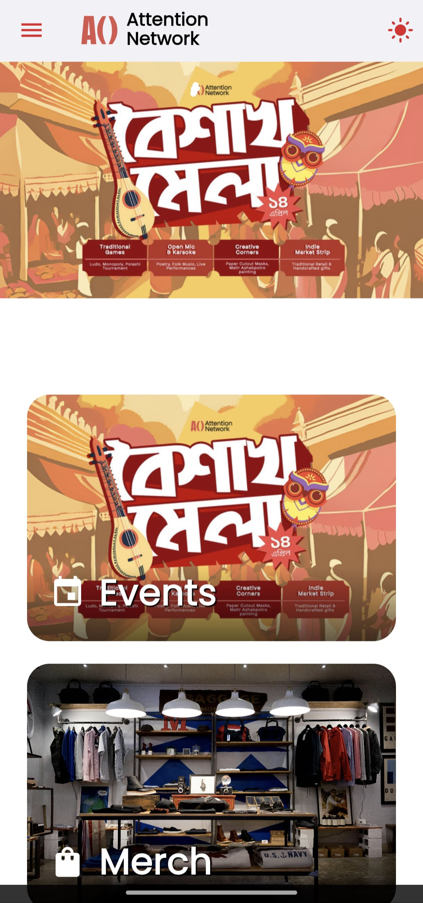
  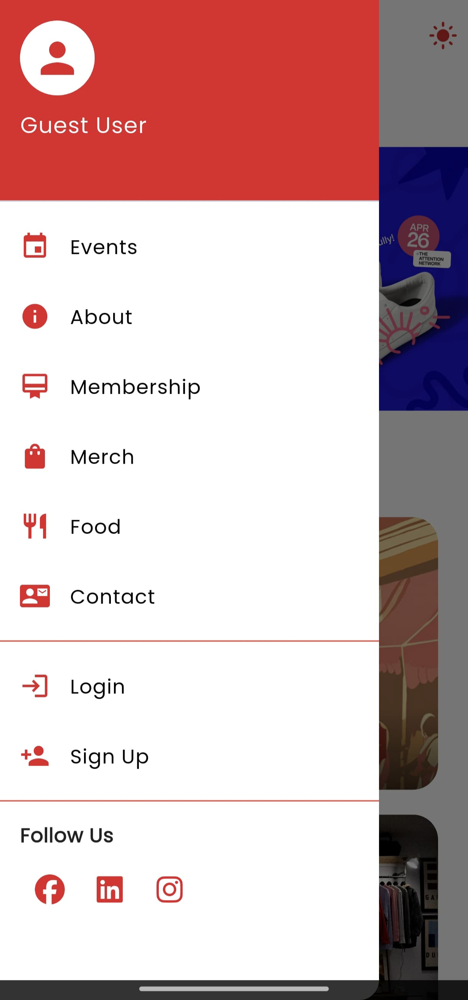
  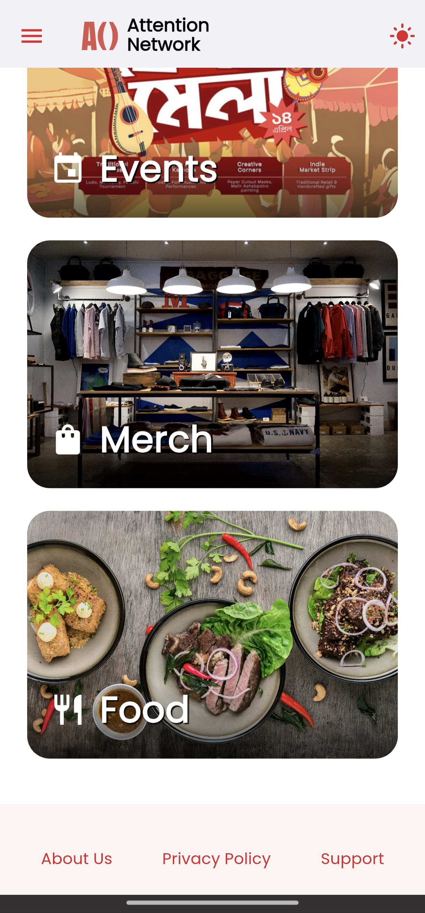
  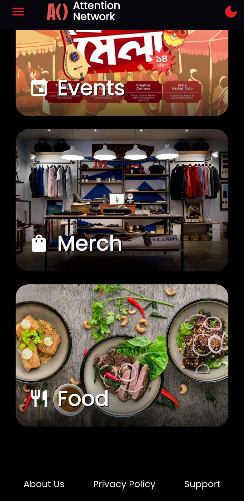
</p>

<p align="center">
  
  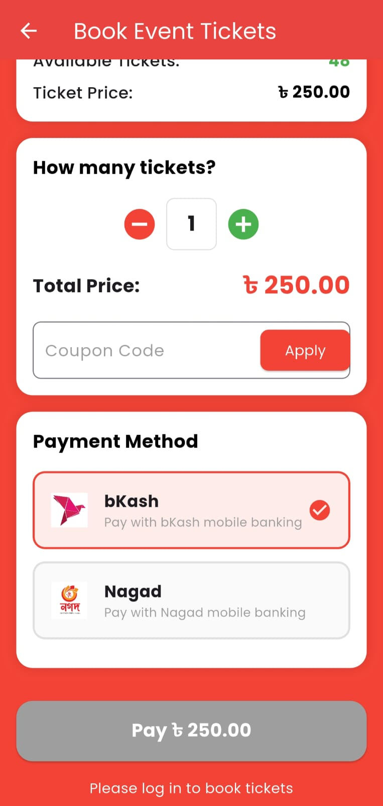
  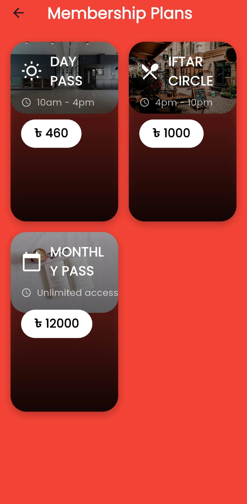
  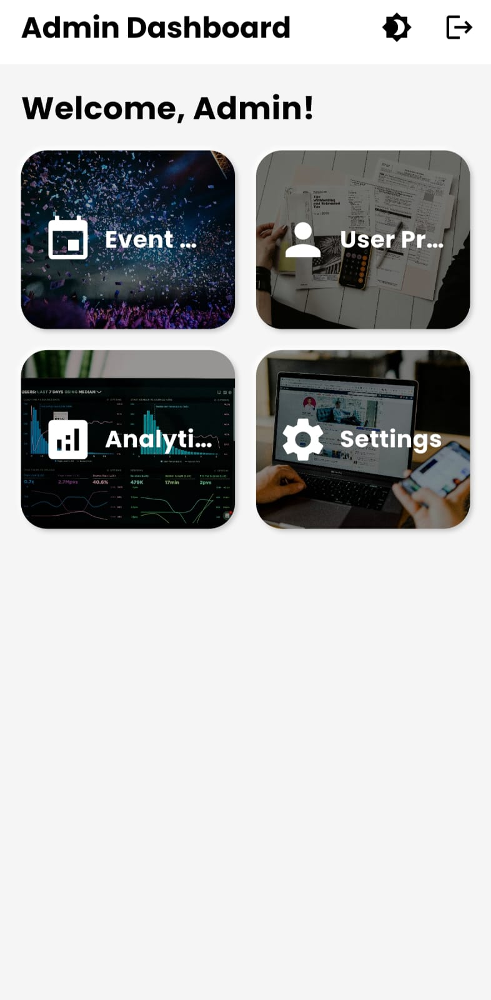
</p>

<p align="center">
  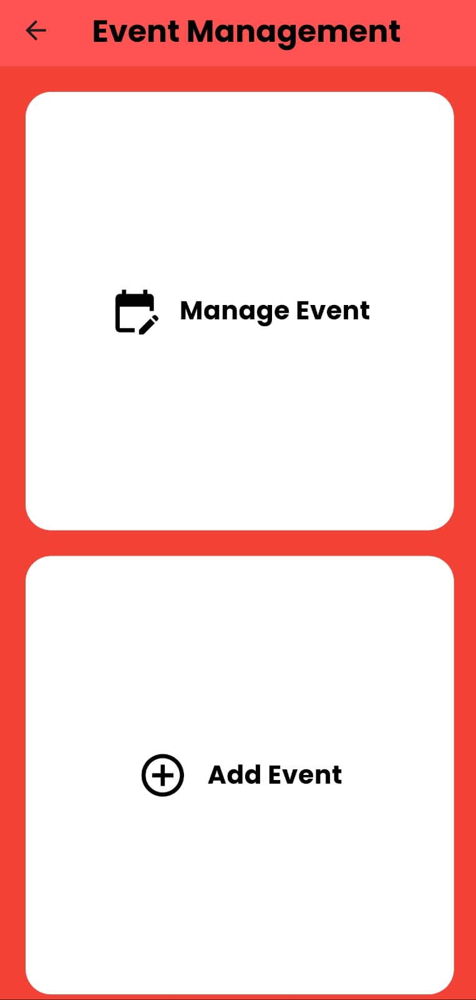
  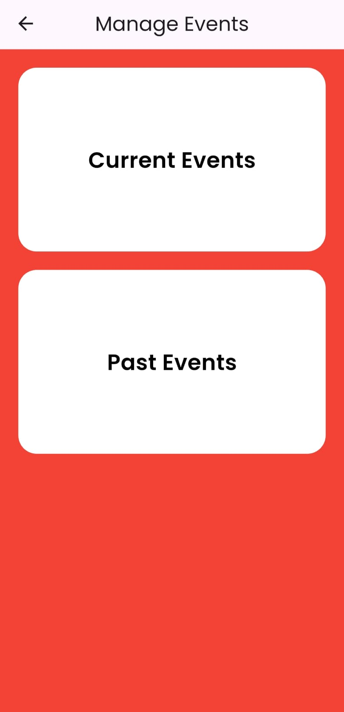
  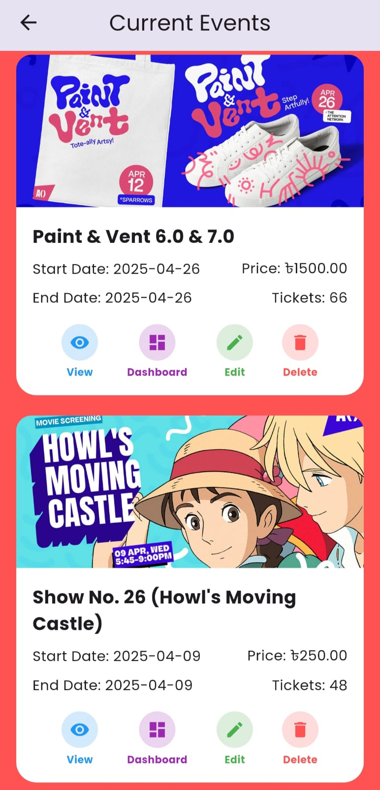
  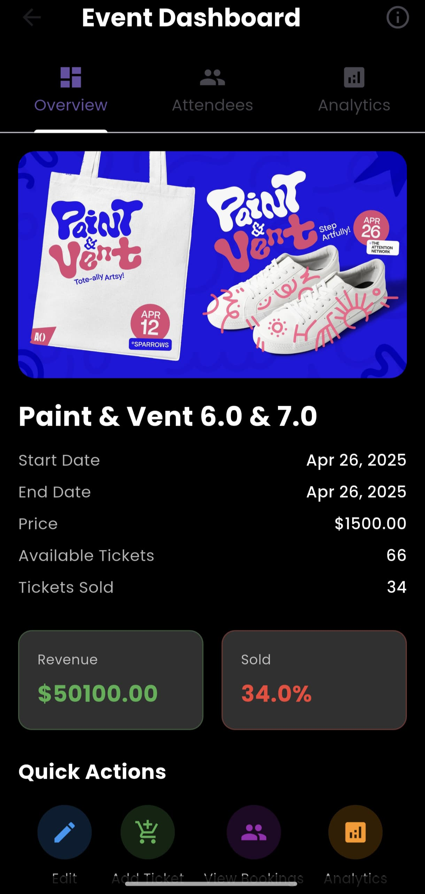
</p>

<p align="center">
  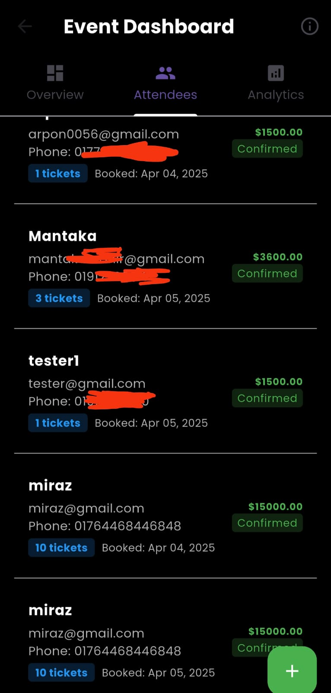
  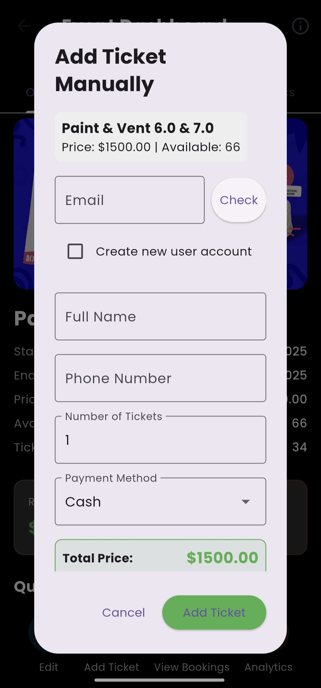
  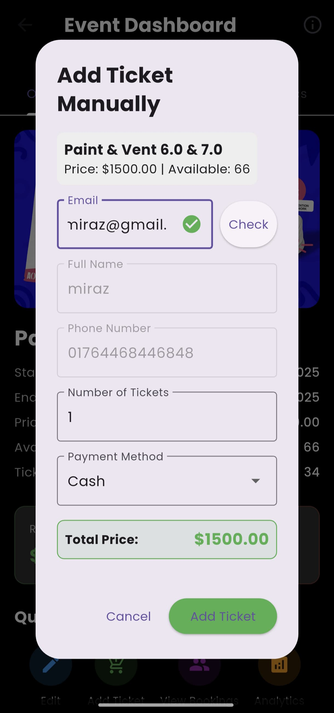
  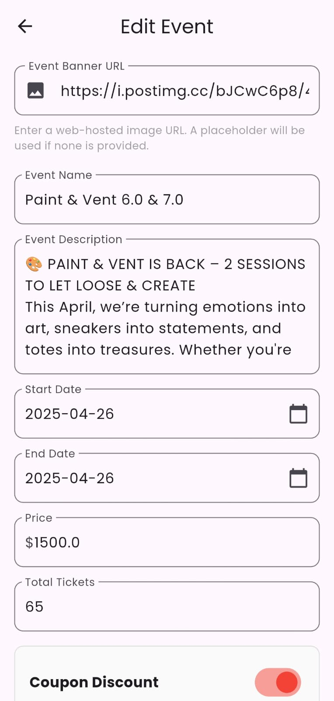
</p>

<p align="center">
  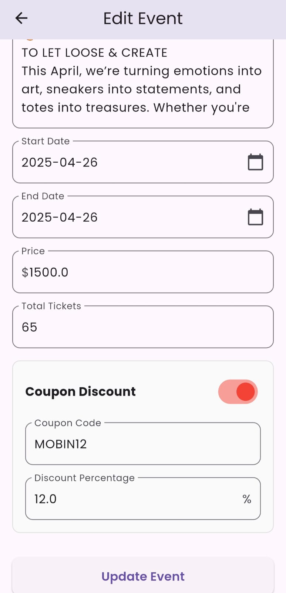
</p>

---

## 🎯 How It Works

### Data Flow Architecture
```
┌─────────────────┐    ┌─────────────────┐    ┌─────────────────┐
│   Flutter App   │ ←→ │   Providers     │ ←→ │   Services      │
│   (UI Layer)    │    │ (State Mgmt)    │    │ (Business Logic)│
└─────────────────┘    └─────────────────┘    └─────────────────┘
                                                        │
                                                        ↓
                                               ┌─────────────────┐
                                               │   Firebase      │
                                               │   Backend       │
                                               └─────────────────┘
```

### Core Components
1. **Authentication Service** - Handles user login/logout with Firebase Auth
2. **Event Provider** - Manages event state and real-time updates
3. **Cart Provider** - Handles shopping cart operations
4. **User Provider** - Manages user profiles and membership data
5. **Firebase Service** - Handles all backend operations

---

## 📦 Dependencies

### Core Dependencies
```yaml
dependencies:
  flutter: ^3.2.6
  firebase_core: ^2.24.2
  firebase_auth: ^4.15.3
  cloud_firestore: ^4.13.6
  firebase_storage: ^11.5.6
  provider: ^6.1.1
  google_fonts: ^6.1.0
  image_picker: ^1.0.4
  shared_preferences: ^2.2.2
```

### Development Dependencies
```yaml
dev_dependencies:
  flutter_test:
    sdk: flutter
  flutter_lints: ^3.0.1
  build_runner: ^2.4.7
```

---

## 🏗️ Project Structure

```
lib/
├── main.dart                    # App entry point
├── homescreen.dart             # Main home screen
├── firebase_options.dart       # Firebase configuration
├── models/                     # Data models
│   ├── user_model.dart
│   ├── event_model.dart
│   ├── food_model.dart
│   └── order_model.dart
├── providers/                  # State management
│   ├── auth_provider.dart
│   ├── event_provider.dart
│   ├── cart_provider.dart
│   └── user_provider.dart
├── services/                   # Business logic
│   ├── firebase_service.dart
│   ├── auth_service.dart
│   └── storage_service.dart
├── screens/                    # All application screens
│   ├── auth/
│   ├── events/
│   ├── food/
│   ├── merchandise/
│   └── admin/
└── widgets/                    # Reusable components
    ├── custom_button.dart
    ├── custom_textfield.dart
    └── loading_widget.dart
```

---

## 🚀 Getting Started

### Prerequisites
- Flutter SDK `>=3.2.6`
- Dart SDK `>=2.18.6`
- Firebase account and project
- Android Studio / VS Code
- Git

### Installation

1. **Clone the repository**
   ```bash
   git clone https://github.com/Mantaka-Mahir/Anetwork.git
   cd Anetwork
   ```

2. **Install dependencies**
   ```bash
   flutter pub get
   ```

3. **Firebase Setup**
   ```bash
   # Install Firebase CLI
   npm install -g firebase-tools
   
   # Login to Firebase
   firebase login
   
   # Initialize Firebase
   firebase init
   ```

4. **Configure Firebase**
   - Create a new Firebase project
   - Enable Authentication, Firestore, and Storage
   - Download configuration files:
     - `google-services.json` → `android/app/`
     - `GoogleService-Info.plist` → `ios/Runner/`

5. **Run the application**
   ```bash
   flutter run
   ```

---

## 🔧 Build & Deploy

### Android
```bash
# Debug build
flutter build apk --debug

# Release build
flutter build apk --release

# App Bundle for Play Store
flutter build appbundle --release
```

### iOS
```bash
# Debug build
flutter build ios --debug

# Release build
flutter build ios --release
```

### Web
```bash
# Build for web
flutter build web

# Serve locally
flutter build web && firebase serve
```

---

## 🧪 Testing

```bash
# Run all tests
flutter test

# Run tests with coverage
flutter test --coverage

# Run integration tests
flutter drive --target=test_driver/app.dart
```

---

## 🤝 Contributing

We welcome contributions! Please follow these steps:

1. **Fork the repository**
2. **Create a feature branch**
   ```bash
   git checkout -b feature/amazing-feature
   ```
3. **Commit your changes**
   ```bash
   git commit -m 'Add amazing feature'
   ```
4. **Push to the branch**
   ```bash
   git push origin feature/amazing-feature
   ```
5. **Open a Pull Request**

### Development Guidelines
- Follow Flutter best practices
- Write tests for new features
- Update documentation
- Use conventional commit messages

---

## 📄 License

This project is licensed under the MIT License - see the [LICENSE](LICENSE) file for details.

---

## 🙋‍♂️ Support & Contact

<div align="center">
  
  **Need help?** We're here to assist!
  
  [](https://github.com/Mantaka-Mahir/Anetwork/issues)
  [](https://github.com/Mantaka-Mahir/Anetwork/discussions)
  
  For questions, bug reports, or feature requests, please create an issue on GitHub.
  
</div>

---

<div align="center">
  <p><strong>Event Management App</strong> - Empowering organizations with comprehensive event management solutions</p>
  <p>Made with ❤️ using Flutter & Firebase</p>
</div>
